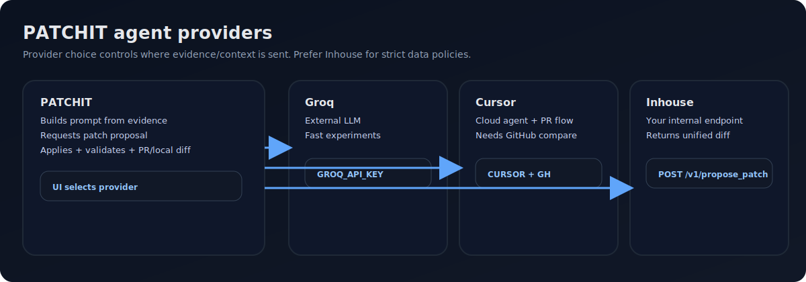
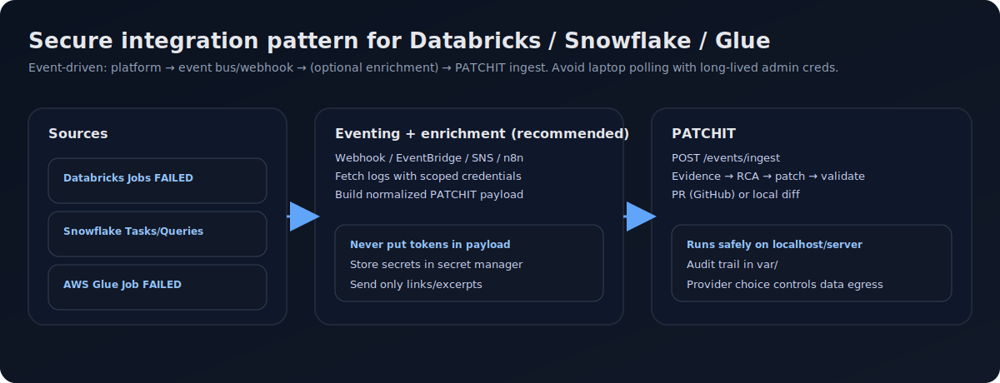
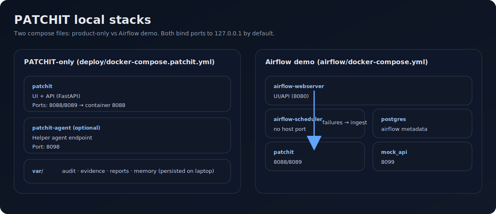

## PATCHIT — Pipeline Auto-Triaging, Code Healing & Incident Transformation

PATCHIT ingests failure events (Airflow/dbt/Spark today, extensible to Databricks/Snowflake/Glue), collects evidence, produces an RCA, proposes a minimal safe patch, and optionally creates a GitHub PR (or a local worktree diff) — with full audit/evidence history in `var/`.

---

### What `docker compose` starts (and security concerns)

This repo has **two** Compose stacks. Which services start depends on the folder/file you run.

#### 1) PATCHIT-only (product) — recommended on a company laptop

Command:

```bash
docker compose -f deploy/docker-compose.patchit.yml --env-file deploy/patchit.env up -d --build
```

Services started:
- **`patchit`**: FastAPI service + UI (single process)
  - **Ports (host)**: `127.0.0.1:${PATCHIT_PORT:-8088}` and `127.0.0.1:${PATCHIT_UI_PORT:-8089}` (both map to container `8088`)
  - **Data**: persists to `./var/` (audit/evidence/reports/memory)
  - **Security concerns**:
    - If you bind to `0.0.0.0` (don’t), anyone on your network could hit the API/UI and potentially trigger remediation actions.
    - PATCHIT can read/write within allowlisted paths in mounted repos; treat it like a privileged dev tool.
    - Depending on agent mode, code/log excerpts may be sent to an external LLM provider.
- **`patchit-agent`**: optional helper service (used in “bytez” mode / fallback)
  - **Port (host)**: `127.0.0.1:${PATCHIT_AGENT_PORT:-8098}`
  - **Security concerns**:
    - If configured, it can send prompt context to a third party (depending on `BYTEZ_*` settings).
    - Disable if unused (see “Hardening checklist”).

#### 2) Airflow demo stack — for drills only (starts many services)

Command:

```bash
cd airflow
docker compose -p patchit_airflow -f docker-compose.yml up -d --build
```

Services started:
- **`airflow-webserver`** (Airflow UI/API): `127.0.0.1:8080`
  - **Security concerns**: demo credentials (`airflow/airflow`); keep localhost-only.
- **`airflow-scheduler`**: no host port
- **`postgres`**: no host port (stores Airflow metadata at `airflow/pgdata/`)
  - **Security concerns**: default dev password in compose; fine locally, don’t reuse elsewhere.
- **`patchit`**: `127.0.0.1:8088` + `127.0.0.1:8089`
- **`patchit-agent`**: `127.0.0.1:8098`
- **`mock_api`**: `127.0.0.1:8099` (demo service)
- **`airflow-init`**: one-shot init container

#### Why `127.0.0.1` matters
Binding ports to `127.0.0.1` makes services accessible **only from your laptop** (not from Wi‑Fi/VPN/LAN peers). This is the single biggest safety control for running PATCHIT on a company machine.

---

### Quickstart: PATCHIT-only (fresh laptop / company laptop)

#### Prereqs
- Docker Desktop **or** Rancher Desktop (Docker-compatible runtime + `docker compose`)
- Git

#### Run

```bash
git clone <your-repo-url>
cd PATCHIT-Auto-Remediation-Observability-Agent

# Create local env (DO NOT commit your real values)
cp deploy/patchit.env.example deploy/patchit.env

# Start PATCHIT-only
docker compose -f deploy/docker-compose.patchit.yml --env-file deploy/patchit.env up -d --build
```

Open:
- **PATCHIT UI**: `http://127.0.0.1:${PATCHIT_UI_PORT:-8089}/ui`
- **API docs**: `http://127.0.0.1:${PATCHIT_PORT:-8088}/docs`

Health checks:

```bash
curl -s "http://127.0.0.1:${PATCHIT_PORT:-8088}/health" && echo
curl -s "http://127.0.0.1:${PATCHIT_PORT:-8088}/api/audit/recent?n=1" && echo
```

#### Keeping or migrating history
PATCHIT persists everything in `./var/`:
- **Same laptop, restarts**: history persists automatically.
- **New laptop**: copy the entire `var/` directory into the new clone before starting containers.

---

### Hardening checklist (company laptop)
- **Keep localhost-only bindings** (default in both compose files).
- **Never commit secrets**: keep `.env` files untracked (`**/.env` and `deploy/patchit.env` are ignored).
- **Prefer inhouse AI** if you cannot send code/logs outside your network.
- **Minimize GitHub PAT scope** if you enable PR creation (Fine-Grained PAT restricted to the specific repo(s)):
  - Contents: Read/Write
  - Pull Requests: Read/Write
- **Disable `patchit-agent`** if unused (comment it out in `deploy/docker-compose.patchit.yml`).
- **Avoid mounting the Docker socket** unless you truly need container-based validation inside PATCHIT.

---

## Agent providers (Groq / Cursor / Inhouse)

PATCHIT supports multiple “agent modes”. Choose based on your data policy.

### Groq
- **Use when**: you want a fast external LLM for experiments.
- **Security**: code/log excerpts may be sent to Groq; do not use if prohibited.
- **Setup**: set `GROQ_API_KEY` (demo stack) and/or configure Groq in the PATCHIT UI provider selector.

### Cursor (Cloud Agents)
- **Use when**: you want Cursor’s patch generator + GitHub PR flow.
- **Requirements**:
  - `PATCHIT_GITHUB_MODE=real`
  - `PATCHIT_GITHUB_TOKEN` and `PATCHIT_GITHUB_REPO`
  - `PATCHIT_CURSOR_API_KEY` and `PATCHIT_CURSOR_REPOSITORY`
- **Security**: sends context to Cursor and creates PRs on GitHub.

### Inhouse (recommended for company use)
Inhouse is an HTTP endpoint you own (behind your network controls) which returns a unified diff.

**Inhouse agent contract**:
- **POST** `/v1/propose_patch`
- **Response JSON** must include either:
  - `diff` (unified diff text), or
  - `patch` (unified diff text)

Minimal response example:

```json
{"diff":"diff --git a/foo.py b/foo.py\nindex 111..222 100644\n--- a/foo.py\n+++ b/foo.py\n@@\n-raise Exception('boom')\n+return None\n"}
```



---

## Data platforms: Databricks / Snowflake / AWS Glue (secure approach)

PATCHIT should **not** poll production platforms from a laptop with long-lived admin credentials. Recommended approach:
- Emit failure events from the platform (or its cloud event bus)
- Transform/enrich (optional: n8n/Lambda)
- POST a normalized event to PATCHIT `/events/ingest`



### Databricks (Jobs)
**Best practice**: Databricks job notifications → webhook/Lambda/n8n → PATCHIT ingest.

High-level steps:
1. Create an internal webhook receiver (n8n or a small API inside your network).
2. Configure Databricks job notifications for failures.
3. Receiver fetches minimal logs and posts to PATCHIT:
   - `pipeline_id`: `databricks:<job_name>`
   - `run_id`: job run id
   - `log_uri`: Spark driver log URL (or attach as `artifact_uris`)
   - `metadata`: workspace URL, job URL, cluster id

Security notes:
- Use a dedicated service principal / token with least privilege to read job run output.
- Keep tokens in the receiver’s secret manager (never in the event payload).

### Snowflake (Tasks / dbt runs)
**Best practice**: Snowflake notification integration → cloud event → function → PATCHIT ingest.

What to send:
- `pipeline_id`: `snowflake:<db>:<schema>:<task>`
- `run_id`: task run id or query id
- `log_uri`: link to query profile / error output
- `metadata`: warehouse, role, dbt invocation id (if applicable)

Security notes:
- Use a dedicated Snowflake role with read-only access to the required history/logs.
- Prefer “push” notifications; avoid laptop polling with broad privileges.

### AWS Glue (Jobs)
**Best practice**: EventBridge rule on Glue job state change → Lambda → PATCHIT ingest.

Steps:
1. EventBridge rule for Glue Job state `FAILED`.
2. Lambda fetches CloudWatch logs + job run details and posts to PATCHIT.

Security notes:
- Lambda role least privilege: CloudWatch read + `glue:GetJobRun`.

---

## Observability dashboards
Streamlit dashboard lives in `observability_dashboard/` (separate from PATCHIT UI). See `observability_dashboard/README.md`.

## Demo / drills
- Airflow demo runbook: `airflow/README.md`
- Drill plan: `PATCHIT_DRILL_PLAN.md`



---

## End-to-end test: PATCHIT + Airflow demo stack (recommended validation on a new laptop)

This is the fastest way to validate that **PATCHIT is receiving Airflow failure signals + logs**, producing audit events, and (optionally) generating a patch/PR.

### 1) Start the demo stack

From repo root:

```bash
cd airflow
docker compose -p patchit_airflow -f docker-compose.yml up -d --build
```

Open:
- **Airflow UI**: `http://127.0.0.1:8080` (user/pass: `airflow` / `airflow`)
- **PATCHIT UI**: `http://127.0.0.1:8089/ui`

Sanity checks:

```bash
curl -s "http://127.0.0.1:8089/health" && echo
```

### 2) Trigger a few deterministic failure scenarios

You can trigger via the Airflow UI (“Trigger DAG w/ config”) or via CLI.

#### CLI trigger (copy/paste)

```bash
# Example 1: JSON parsing issue
docker compose -p patchit_airflow -f docker-compose.yml exec -T airflow-webserver \
  airflow dags trigger -c '{"scenario":"partial_json"}' patchit_complex_test_dag

# Example 2: schema drift / missing field
docker compose -p patchit_airflow -f docker-compose.yml exec -T airflow-webserver \
  airflow dags trigger -c '{"scenario":"schema_drift"}' patchit_complex_test_dag

# Example 3: dbt-ish missing column (demo)
docker compose -p patchit_airflow -f docker-compose.yml exec -T airflow-webserver \
  airflow dags trigger -c '{"scenario":"dbt_missing_column"}' patchit_complex_test_dag
```

Optional chaos DAG (randomized failures):

```bash
docker compose -p patchit_airflow -f docker-compose.yml exec -T airflow-webserver \
  airflow dags trigger -c '{"scenario":"random"}' patchit_chaos_dag
```

### 3) What to expect in PATCHIT UI

Open `http://127.0.0.1:8089/ui` → **Event Console**.

Within ~10–60 seconds after the DAG run fails, you should see:
- **A new event card** appear (new correlation id)
- **Evidence / report events** (e.g. `evidence.saved`, `report.saved`)
- A terminal outcome event:
  - **If credentials are missing** (common on fresh laptop): `remediation.escalated` or `agent.failed` explaining what config is required
  - **If Groq/Cursor/Inhouse is configured**: you should see patch generation steps and either:
    - a **GitHub PR** event (when `PATCHIT_GITHUB_MODE=real` and creds exist), or
    - a **local diff/worktree** outcome (if you’re using local mode), or
    - a **mock PR** (demo mode) saved under `/.mock_github/prs/`

Where to look on disk:
- **Audit log**: `var/audit/patchit_audit.jsonl`
- **Reports**: `var/reports/`
- **Evidence**: `var/evidence/`
- **Patch diffs**: `var/patches/`
- **Mock PRs** (if enabled): `.mock_github/prs/`

### 4) Stop the demo stack

```bash
docker compose -p patchit_airflow -f docker-compose.yml down --remove-orphans
```

---

## Publishing this updated README (commit + push)

From repo root:

```bash
git status
git add README.md docs/images/*.svg deploy/README.md
git commit -m "docs: add end-to-end Airflow demo validation + security notes"
git push
```

Note: I can’t directly push to your GitHub from this environment; the above is the exact sequence to run on your laptop.


